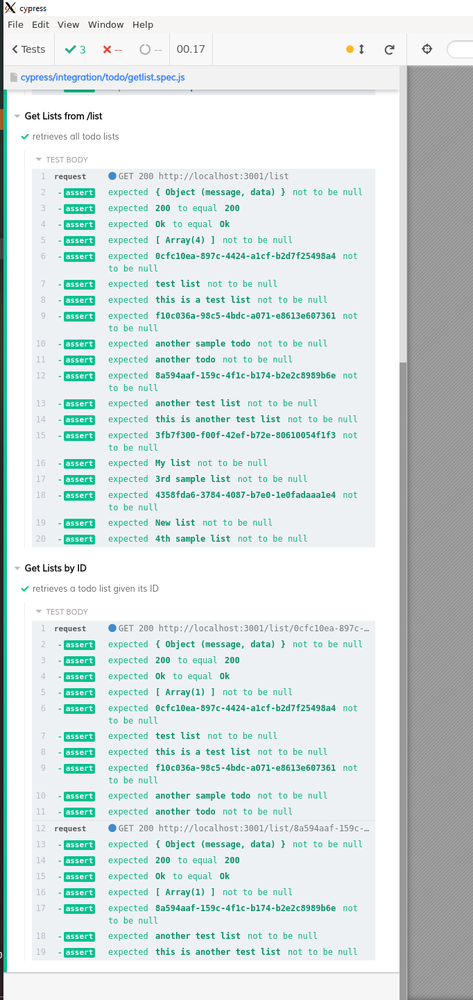

# Golang with Cypress Sample App
This is an example golang todo API that uses cypress for api testing.

## What It Does
The API allows you to create several todo lists and add todo items on the list by providing its list id when requesting to add a todo item.

### Configure Environment Variables
- `TODO_SVC_HOST` is the server host (ex: localhost)
- `TODO_SVC_PORT` is the server port (ex: 8080 or 3001)
- `MONGODB_SERVER_HOST` is the ip address for your mongodb server
- `MONGODB_SERVER_PORT` is your mongodb server port (ex: default is "27017")
- `MONGODB_CONTEXT_TIMEOUT` is used by mongodb driver when sending requests to mongodb server for timeouts. It is a non-negative number who's unit is in seconds (ex: 10)

### Create a New List
- URI: `<address>:<port>/list`
- Method: `POST`
- Request Message:
```
{
  "name": "SUPER new list",
  "description": "tth sample list"
}
```
- Sample Response:
```
HTTP/1.1 200 OK
Content-Length: 126
Content-Type: application/json
Date: Thu, 19 Nov 2020 13:11:20 GMT

{
    "data": "b555e13d-c09f-44b6-bcbe-13a5a3bda06f",
    "message": "Inserted a single document: ObjectID(\"5fb66ef8efc894d07d5b9c31\")"
}
```

### Get Lists
- URI: `<address>:<port>/list`
- Method: `GET`
- Sample Response:
```
HTTP/1.1 200 OK
Content-Length: 126
Content-Type: application/json
Date: Thu, 19 Nov 2020 13:11:20 GMT

{
    "data": [
        {
            "description": "this is a test list",
            "id": "0cfc10ea-897c-4424-a1cf-b2d7f25498a4",
            "list": [
                {
                    "description": "another sample todo",
                    "id": "f10c036a-98c5-4bdc-a071-e8613e607361",
                    "title": "another todo"
                }
            ],
            "name": "test list"
        },
        {
            "description": "this is another test list",
            "id": "8a594aaf-159c-4f1c-b174-b2e2c8989b6e",
            "list": [],
            "name": "another test list"
        },
        {
            "description": "3rd sample list",
            "id": "3fb7f300-f00f-42ef-b72e-80610054f1f3",
            "list": [],
            "name": "My list"
        },
        {
            "description": "4th sample list",
            "id": "4358fda6-3784-4087-b7e0-1e0fadaaa1e4",
            "list": [],
            "name": "New list"
        },
        {
            "description": "tth sample list",
            "id": "b555e13d-c09f-44b6-bcbe-13a5a3bda06f",
            "list": [],
            "name": "SUPER new list"
        }
    ],
    "message": "Ok"
}
```

### Sample Cypress Output
